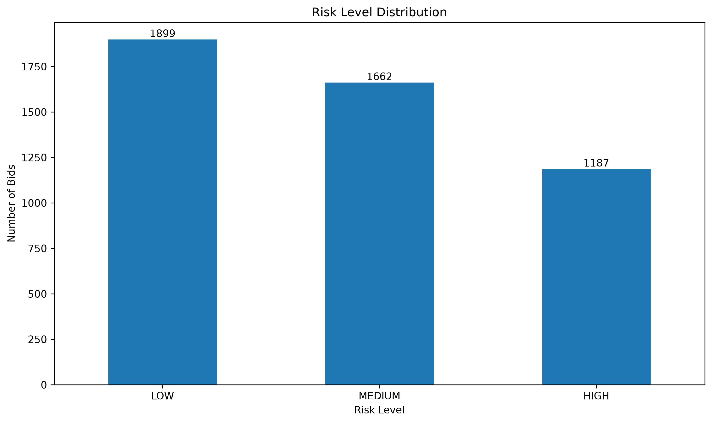
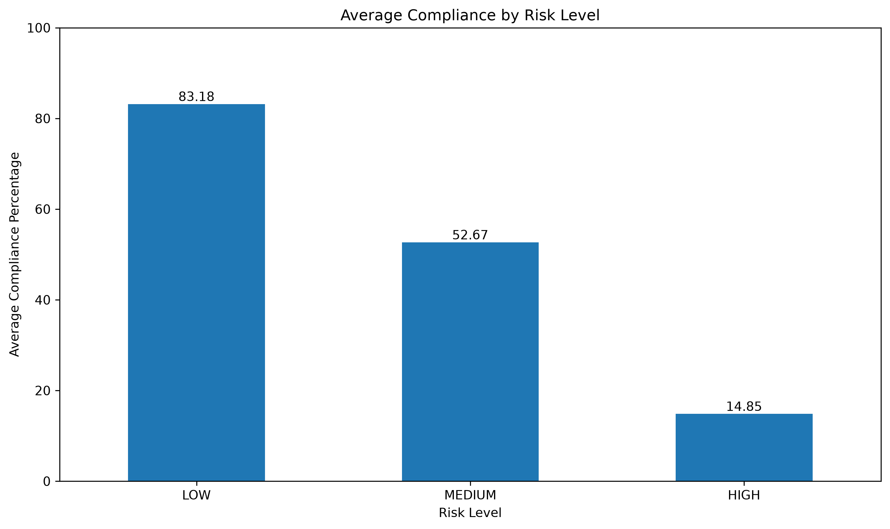
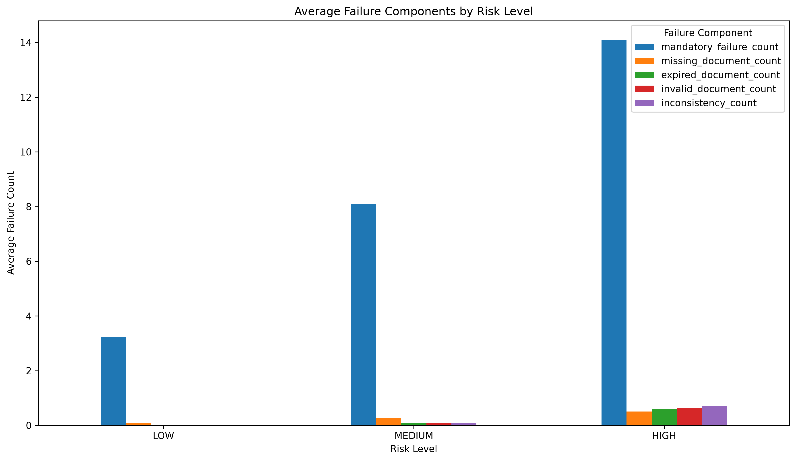
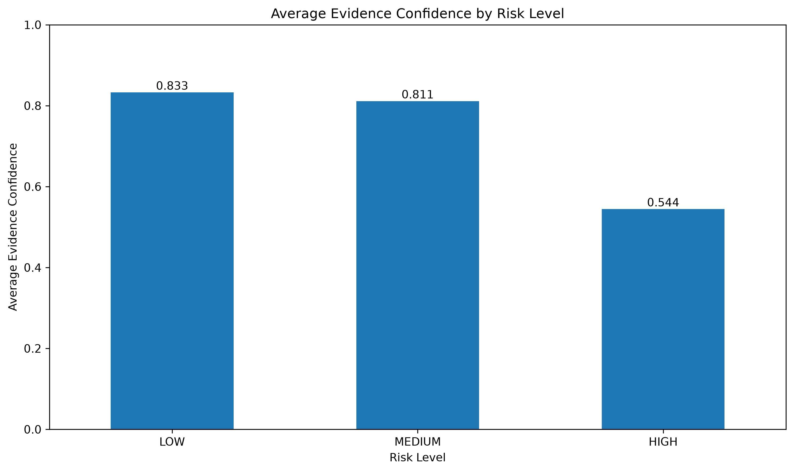
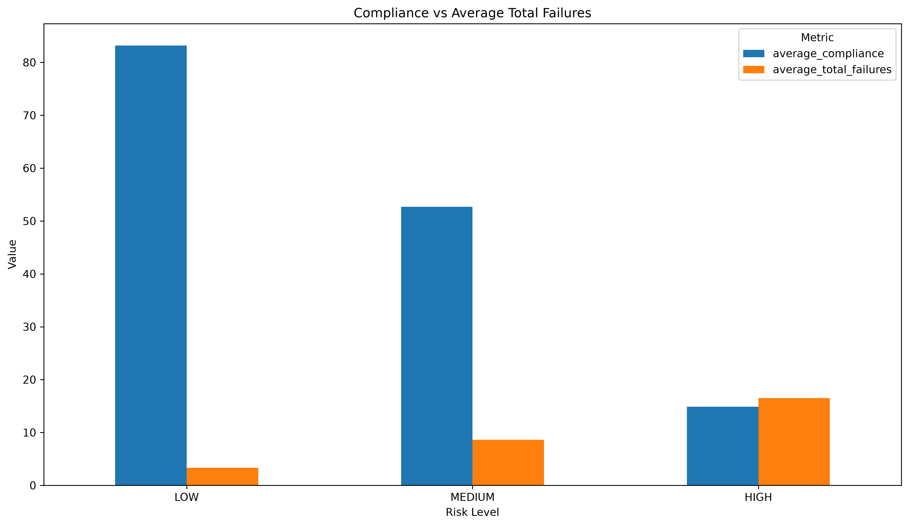

# BidGuard AI — Exploratory Data Analysis Conclusions

## 1. Dataset Overview

- Total bids analysed: **4,748**
- Dataset contains bid-level compliance, document quality, evidence confidence, and risk-related features.
- The EDA was performed to understand the relationship between bid compliance, document failures, evidence quality, and overall risk.

---

## 2. Risk Level Distribution

| Risk Level | Bid Count | Percentage |
|------------|----------:|-----------:|
| LOW | 1,899 | 40.00% |
| MEDIUM | 1,662 | 35.00% |
| HIGH | 1,187 | 25.00% |
| **Total** | **4,748** | **100.00%** |

The dataset contains three risk categories: LOW, MEDIUM, and HIGH.

LOW-risk bids represent the largest group at 40%, followed by MEDIUM-risk bids at 35% and HIGH-risk bids at 25%.

---

## 3. Compliance Analysis

### Average Compliance by Risk Level

| Risk Level | Average Compliance |
|------------|-------------------:|
| LOW | 83.18% |
| MEDIUM | 52.67% |
| HIGH | 14.85% |

The overall average compliance across all bids is **55.42%**.

LOW-risk bids show the highest average compliance at **83.18%**, while HIGH-risk bids show the lowest average compliance at **14.85%**.

This indicates a strong relationship between compliance performance and the assigned risk level.

---

## 4. Failure Analysis

### Average Failure Counts by Risk Level

| Risk Level | Mandatory Failures | Missing Documents | Expired Documents | Invalid Documents | Inconsistencies | Total Failures |
|------------|-------------------:|------------------:|------------------:|------------------:|----------------:|---------------:|
| LOW | 3.23 | 0.09 | 0.01 | 0.01 | 0.00 | 3.34 |
| MEDIUM | 8.09 | 0.28 | 0.10 | 0.09 | 0.07 | 8.63 |
| HIGH | 14.09 | 0.50 | 0.60 | 0.62 | 0.71 | 16.52 |

The overall average mandatory failure count is **7.64**.

HIGH-risk bids have the highest average mandatory failures (**14.09**) and the highest average total failures (**16.52**).

LOW-risk bids have substantially fewer failures, with an average total failure count of **3.34**.

---

## 5. Evidence Confidence Analysis

### Average Evidence Confidence by Risk Level

| Risk Level | Average Evidence Confidence |
|------------|----------------------------:|
| LOW | 0.833 |
| MEDIUM | 0.811 |
| HIGH | 0.544 |

The overall average evidence confidence is **0.753**.

LOW-risk bids have the highest average evidence confidence (**0.833**), while HIGH-risk bids have the lowest (**0.544**).

The lower evidence confidence observed in HIGH-risk bids provides an additional signal associated with elevated bid risk.

---

## 6. Compliance vs Total Failures

| Risk Level | Average Compliance | Average Total Failures |
|------------|-------------------:|-----------------------:|
| LOW | 83.18% | 3.34 |
| MEDIUM | 52.67% | 8.63 |
| HIGH | 14.85% | 16.52 |

The analysis shows an inverse relationship between compliance and failure counts.

As risk level increases:

- Average compliance decreases.
- Average mandatory failures increase.
- Average total failures increase.
- Evidence confidence decreases, particularly for HIGH-risk bids.

---

## 7. Overall Dataset Risk Summary

| Metric | Overall Value |
|--------|--------------:|
| Total Bids | 4,748 |
| LOW-risk Bids | 1,899 |
| MEDIUM-risk Bids | 1,662 |
| HIGH-risk Bids | 1,187 |
| Average Compliance | 55.42% |
| Average Evidence Confidence | 0.753 |
| Average Document Quality | 0.822 |
| Average Mandatory Failures | 7.64 |

---

## 8. Key EDA Findings

1. **LOW-risk bids have the highest average compliance** at 83.18%.
2. **HIGH-risk bids have the lowest average compliance** at 14.85%.
3. **HIGH-risk bids have the highest average mandatory failures** at 14.09.
4. **HIGH-risk bids have the highest average total failures** at 16.52.
5. **LOW-risk bids have the highest evidence confidence** at 0.833.
6. **HIGH-risk bids have the lowest evidence confidence** at 0.544.
7. The dataset contains a clear relationship between compliance, failure counts, evidence confidence, and risk level.
8. The observed patterns provide meaningful signals for AI-based bid compliance verification and risk assessment.

---

## 9. EDA Conclusion

The exploratory analysis demonstrates that bid risk levels are strongly associated with compliance and document-related failure patterns.

LOW-risk bids generally exhibit high compliance, fewer failures, and stronger evidence confidence. In contrast, HIGH-risk bids demonstrate substantially lower compliance, higher mandatory and total failure counts, and lower evidence confidence.

These findings indicate that the dataset contains meaningful predictive signals for developing the **BidGuard AI** system.

The EDA therefore provides a data-driven foundation for the next stages of the project, including feature engineering, model development, risk prediction, and bid compliance assessment.

---

## 10. EDA Status

**EDA completed successfully.**

The following visualizations have been exported to `reports/eda/`:

- `risk_level_distribution.png`
- `compliance_by_risk.png`
- `evidence_confidence_by_risk.png`
- `failure_components_by_risk.png`
- `compliance_vs_failures.png`

The completed EDA notebook is available at:

`notebooks/01_dataset_eda.ipynb`